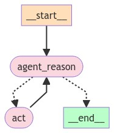

# LangGraph-react
Sandbox for LangGraph. In this example, LangGraph with ReAct



## setup
- install python3
- install dependencies `pip3 install -r requirements.txt`
- set .env file with api key of supported llm
```ini
MISTRAL_API_KEY=S0m#-Ap1_K#y-F0r_MiStR@L
OPENAI_API_KEY=S0m#-Ap1_K#y-F0r_OPENAI
TAVILY_API_KEY=S0m#-Ap1_K#y-F0r_TAVILY
LANGCHAIN_API_KEY=S0m#-Ap1_K#y-F0r_LANGCHAIN
LANGCHAIN_TRACING_V2=true
LANGCHAIN_ENDPOINT=https://api.smith.langchain.com
LANGCHAIN_PROJECT=LangGraph-ReAct
```
- set instruction in [`main.py`](main.py)
```python
res = app.invoke(
    input={
        "input": "what is the weather in sf? List it and then Triple it ",
    }
```

## execute
`python3 main.py`

## output example
```text
Hello ReAct with LangGraph
The current weather in San Francisco is 55.0°F and when tripled, it is 165.0°F.
```